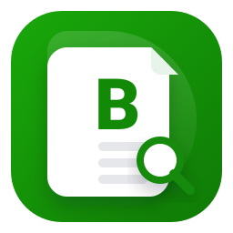
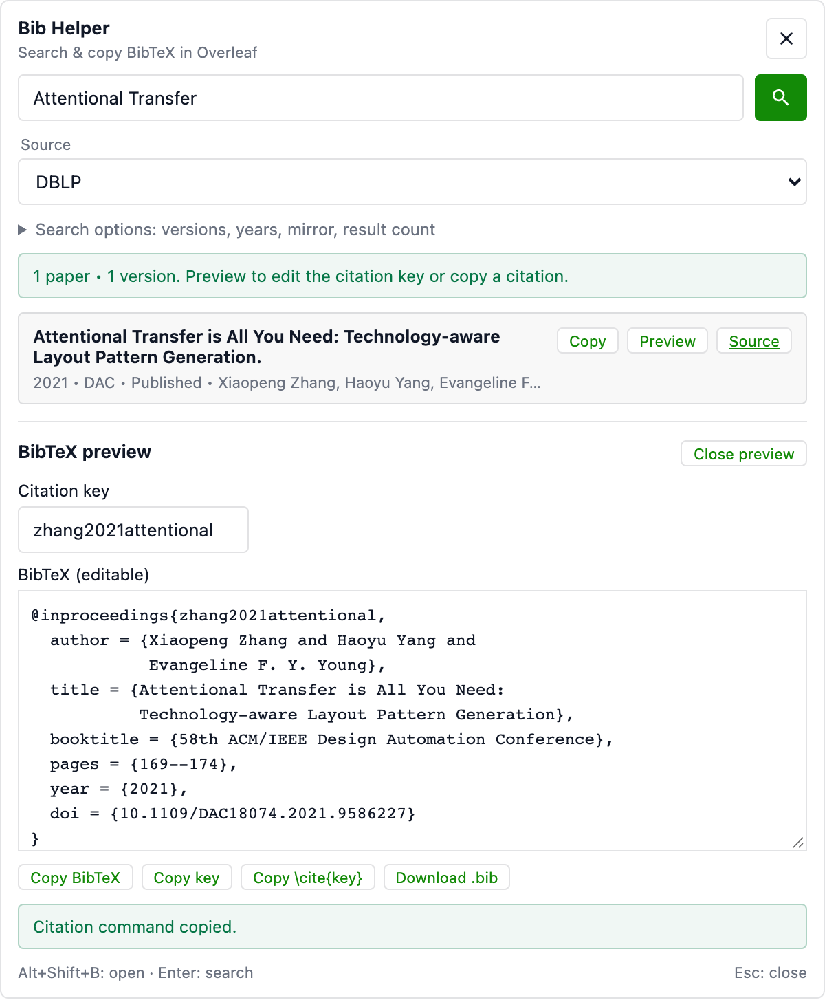

<div align="center">
  
  <h1>Overleaf-Bib-Helper</h1>
</div>

<p align="center">
  <a href="https://greasyfork.org/zh-CN/scripts/532304-overleaf-bib-helper">
    
  </a>
  <a href="https://github.com/MLNLP-World/Overleaf-Bib-Helper/releases">
    
  </a>
  <a href="LICENSE">
    
  </a>
  <a href="https://github.com/MLNLP-World/Overleaf-Bib-Helper/stargazers">
    
  </a>
  <a href="https://github.com/MLNLP-World/Overleaf-Bib-Helper/network/members">
    
  </a>
  <a href="https://github.com/MLNLP-World/Overleaf-Bib-Helper/issues">
    
  </a>
  <a href="https://github.com/MLNLP-World/Overleaf-Bib-Helper/pulls">
    
  </a>
</p>

---

<div>
<p align="center">
      <a href="#安装">安装</a> •
      <a href="#使用方法">使用方法</a> •
      <a href="#支持的来源">支持的来源</a> •
      <a href="#故障排除">故障排除</a> •
      <a href="#免责声明">免责声明</a> •
      <a href="#更新日志">更新日志</a> •
      <a href="#许可证">许可证</a> •
      <a href="#贡献">贡献</a> •
      <a href="#联系方式">联系方式</a> •
      <a href="#组织者">组织者</a> •
      <a href="#致谢">致谢</a>
    </p>
</div>

## 动机
编写LaTeX文档通常需要包含大量的学术参考文献。手动搜索和格式化BibTeX条目可能非常耗时。Overleaf-Bib-Helper通过将DBLP和Google Scholar的搜索功能集成到Overleaf界面中，简化了这一过程，使用户能够快速找到并复制BibTeX条目，省时省力。

## 功能
- 适配新版和旧版 Overleaf toolbar；切换文件或布局后自动恢复 `Bib` 按钮。
- `Alt+Shift+B` 或 Tampermonkey menu 随时打开，可将选中的论文标题带入搜索框。
- BibTeX 预览与编辑、citation key 修改、一键复制 key 或 `\cite{key}`、下载 `.bib` 文件。
- 保存最近 10 次查询，缓存已验证的 BibTeX；默认使用 DBLP，保留已有用户的数据源偏好。
- Search options 折叠高级筛选；面板适配小窗口，并跟随 Overleaf editor 的明暗主题。
- 在Overleaf中搜索DBLP或Google Scholar中的学术文章。
- 一键检索并复制BibTeX条目。
- 同标题结果自动合并为“Versions (n)”并支持一键“Copy best”。
- DBLP 支持版本偏好（优先正式发表版本，过滤/降权 arXiv/CoRR 预印本）。
- 支持年份范围过滤与排序（相关性/最新/最旧，具体取决于数据源）。
- 可配置的结果数量（5、10、20或50个结果）。
- 可滚动的结果列表，便于浏览。
- 键盘快捷键：Enter键搜索，Esc键关闭弹出窗口。
- 支持多个Google Scholar镜像以提高可访问性。

## 安装
### 第一步：安装Tampermonkey
Tampermonkey是一个运行Overleaf-Bib-Helper等用户脚本所需的浏览器扩展。按照以下步骤操作：
1. **下载Tampermonkey**：
   - **Chrome**：[Chrome网上商店](https://chrome.google.com/webstore/detail/tampermonkey/dhdgffkkebhmkfjojejmpbldmpobfkfo)
   - **Firefox**：[Mozilla插件](https://addons.mozilla.org/en-US/firefox/addon/tampermonkey/)
   - **Edge**：[Microsoft Edge插件](https://microsoftedge.microsoft.com/addons/detail/%E7%AF%A1%E6%94%B9%E7%8C%B4/iikmkjmpaadaobahmlepeloendndfphd)
   - **Safari**：[应用商店](https://apps.apple.com/us/app/tampermonkey/id1482490089)（需要macOS）
2. **启用Tampermonkey**：
   - 安装完成后，点击浏览器工具栏中的Tampermonkey图标，确保其已启用。
3. **允许运行 userscripts**：
   - Chrome 138+ 可在 Tampermonkey 的扩展管理页开启 **Allow User Scripts（允许用户脚本）**；也可开启扩展开发者模式。见 [Tampermonkey 官方说明](https://www.tampermonkey.net/faq.php?q=Q209)。

### 第二步：安装Overleaf-Bib-Helper
您可以通过以下两种方式之一安装脚本：

#### 选项1：从Greasy Fork安装（推荐）
1. 访问[Greasy Fork页面](https://greasyfork.org/zh-CN/scripts/532304-overleaf-bib-helper)。
2. 点击**“安装此脚本”**按钮。
3. Tampermonkey将打开一个确认窗口。点击**“安装”**以添加脚本。
4. 脚本将在Overleaf项目页面（`https://www.overleaf.com/project/*`）上自动激活。
5. 为保持脚本更新，请在Tampermonkey设置中启用自动更新。

#### 选项2：从GitHub安装
1. 前往[GitHub仓库](https://github.com/MLNLP-World/Overleaf-Bib-Helper)。
2. 打开仓库中的`Overleaf-Bib-Helper.js`文件。
3. 复制整个脚本内容。
4. 在浏览器中，点击Tampermonkey图标 > **“创建新脚本”**。
5. 将复制的代码粘贴到编辑器中，替换默认模板。
6. 在Tampermonkey编辑器中点击**文件 > 保存**。
7. 脚本将在Overleaf项目页面上激活。
8. 脚本包含 Greasy Fork 的正式更新地址，从 GitHub 手动安装也可通过 Tampermonkey 接收后续更新。

## 使用方法
### 打开工具
1. 在浏览器中打开Overleaf项目（`https://www.overleaf.com/project/*`）。
2. 点击 editor toolbar 右侧的 **Bib** 按钮；editor toolbar 不可见时，按钮会使用项目顶栏。
3. 也可按 **Alt+Shift+B**，或从 Tampermonkey menu 选择 **Open Bib Helper**。选中论文标题后打开，会自动填入搜索框。


### 搜索文章
1. **输入查询**：在输入字段中键入搜索词（例如文章标题、作者或关键词）。
2. **选择来源**：从“来源”下拉菜单中选择“DBLP”或“Google Scholar”。
   - **DBLP**：最适合计算机科学文献，提供结构化数据。
   - **Google Scholar**：覆盖更广泛的领域，但可能需要验证码验证。
3. **设置结果数量**：从“结果”下拉菜单中选择5、10、20或50个结果。
4. **开始搜索**：
   - 按下**Enter**键或点击放大镜图标。
   - 展开 **Search options** 设置版本、年份、mirror、排序和结果数。DBLP 的筛选与排序作用于最多 200 条候选结果，并非整个数据库。
5. 结果将显示在输入字段下方的可滚动列表中。

### 复制BibTeX
1. 点击 **Copy** 复制条目，或 **Preview** 查看并编辑 BibTeX。
2. Preview 中可修改 citation key，复制 BibTeX、key、`\cite{key}`，或下载 `.bib` 文件。
3. 先把条目加入项目的 `.bib` 文件，再将 citation command 粘贴到 LaTeX 文档。脚本不会自动修改项目文件。
4. 预览中的复制和下载会验证 BibTeX；网络错误或验证码页面不会覆盖剪贴板。

<div align="center">

</div>

### 关闭弹出窗口
- 按下**Esc**键或再次点击工具栏图标。

## 支持的来源
- **DBLP**：一个全面的计算机科学书目数据库，提供可靠的BibTeX条目。
- **Google Scholar**：一个更广泛的学术搜索引擎，可能包括更多最新或跨学科的作品，但可能需要用户验证（例如验证码）。

## 故障排除
- **脚本不起作用？**
  - 确保 Tampermonkey 已获允许运行 userscripts；Chrome 可开启 **Allow User Scripts** 或 **开发者模式**。
  - 若图标没有显示，尝试 **Alt+Shift+B** 或 Tampermonkey menu，并确认已更新到 v2.0.1。
  - 确保Tampermonkey已启用且脚本处于活动状态。
  - 确认您在Overleaf项目页面上。
  - 重新加载或从Greasy Fork重新安装。
- **没有结果？**
  - 检查查询是否有拼写错误。
  - 确保你对插件搜索权限进行了授权。
  - 尝试在DBLP和Google Scholar之间切换。
  - DBLP 也可能要求浏览器验证。点击 **Open verification page**，等待网站完成检查后重试。
- **Google Scholar问题？**
  - 点击面板中的 **Open verification page**，在新标签中完成验证后重试；也可点击 **Search DBLP instead**。
  - Scholar 可能限制自动请求；网页能打开不保证 BibTeX export 可用。可切换 mirror，或从 Source 链接手动获取引用。

## 免责声明
虽然Overleaf-Bib-Helper旨在提供无缝体验，但请注意，它依赖于外部服务（DBLP和Google Scholar），这些服务的API可能会更改或需要用户验证（例如验证码）。请自行决定使用此工具，并始终在将检索到的BibTeX条目纳入文档前进行验证。

## 更新日志
- **2026-09-07 (v2.0.1)**：适配新版 toolbar，支持布局切换后恢复入口；移除外部运行依赖；新增快捷键、menu、选中文字搜索、最近查询、BibTeX preview/edit/key/citation/download；增加 timeout、HTTP 与 BibTeX 验证、过期搜索保护、Scholar origin 固定和显式验证入口；修复多语言分组与 Hide preprints 筛选。新增 Playwright regression tests 和 GitHub Actions。
- **2026-02-03**：代码清理与重构，使用 MutationObserver 进行注入（减少轮询），并放宽 `@connect` 以支持自定义 Scholar 镜像（v1.8）。
- **2026-02-03**：Overleaf 主题配色的全新 UI、默认使用 Google Scholar、同标题结果合并为 “Versions (n)” 版本选择、增加镜像选择并支持结果分页（超过 10 条可继续获取），并提供排序/年份范围过滤与 DBLP 版本偏好（优先正式发表版本，过滤/降权 arXiv/CoRR）（v1.7）。
- **2025-04-10**：增加了对 cn.overleaf.com 和 cn.overleaf.com 域的支持（v1.2）。
- **2025-04-09**：初始版本，支持DBLP和Google Scholar的基本功能（v1.1）。

## 许可证
此项目采用MIT许可证 - 详情见[LICENSE](LICENSE)。

## 贡献
欢迎分叉[GitHub仓库](https://github.com/MLNLP-World/Overleaf-Bib-Helper)，提交问题或创建改进的拉取请求！

## 开发与验证
脚本保持单文件，无需 build。测试使用独立浏览器和模拟的网络响应，不访问实际论文项目。

```sh
npm ci
npx playwright install chromium
npm test
```

本机已有 Google Chrome 时，可用 `PW_USE_SYSTEM_CHROME=1 npm test`。GitHub Actions 对 push 和 pull request 运行同一套测试。

## 联系方式
如有任何问题或建议，请发送电子邮件至[Xunjian Yin](mailto:xjyin@pku.edu.cn)或在此处创建Github问题。

## 组织者
<a href="https://github.com/Arvid-pku">   </a>

## 致谢
灵感来源于类似工具和学术界对高效参考管理的需要。
